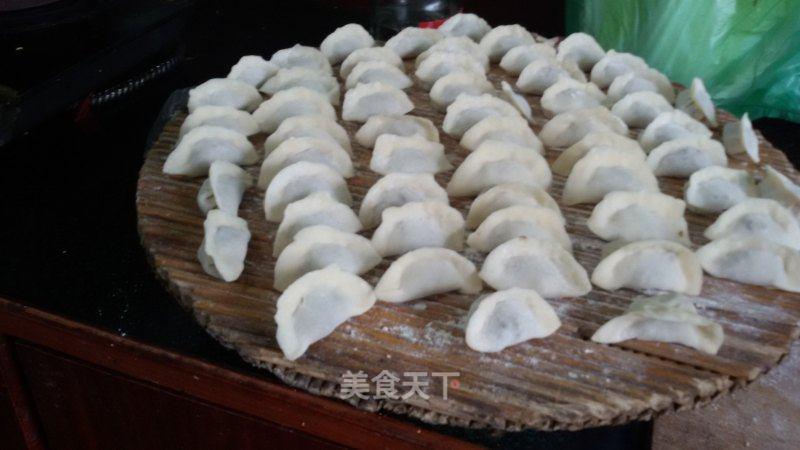
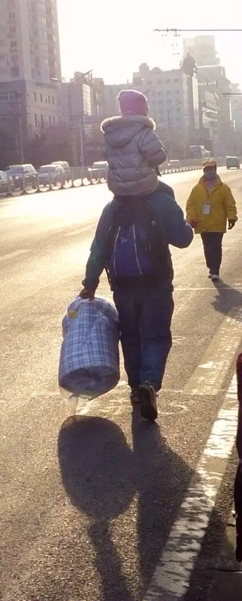

# 北京官话方言词汇

由于北京官话诸方言都与普通话相差不远，本篇使用汉语拼音标音。
若四声无法准确反映读音音高，会采用五度标记法；
若有超出标准拼音表示能力的读音，会用国际音标来严式标音。

本篇使用简体字。

## 正字已知

- <h3 id="篦帘">篦帘</h3>

	&lt;名&gt;
	用于放置包好待煮的饺子的竹制用具。

	

	#### 注释
	北京话中「帘」要儿化，读作 liár。

	广泛闻于北京。
	东北地区似乎也用此词。
	齐鲁谓之「箅子」。

- <h3 id="爆腾">爆腾</h3>

	1. &lt;动0&gt;
		物体表面积灰被扬到空中。

	2. &lt;动0&gt;
		物体因久置而落灰。

	#### 例句
	> 行了行了别掸了。看让你给爆腾1的，满院都是土。
	>
	> 被子晒完了记得收回来，要不上外边爆腾2一天还怎么盖啊。

	#### 近义词
	- [bàng](./heze.md#ㄅㄤˋbàng曝)（菏泽话）

## 正字未知

- <h3>nōu</h3>

	&lt;动1&gt; 受事主语
	物体被久泡而发胀或发臭。

	#### 例句
	> 天天擦汗也不洗，这毛巾都 nōu 成什么样了！
	>
	> 袜子湿了，脚 nōu 得很。

	#### 近义词
	- 泡糟
	- 馊（吴语区用作动词）

	#### 注释
	曾闻于祖籍涞水而居于北京的 40 年代生人。

- <h3>zhōu</h3>

	&lt;动1&gt; 受事宾语
	容器或承载物被翻转。

	#### 例句
	> 把饺子端过去，小心别给[篦帘](#篦帘) zhōu 了。
	>
	> 矿车运到地方之后，把车斗一 zhōu，就卸货了。

	#### 近义词
	- 打翻

	#### 注释
	有闻于北京、东北地区。

- <h3>chuǎ 口</h3>

	&lt;动0&gt; 离合
	吃完油腻食物后用清淡食物或汤爽口。

	#### 例句
	> 吃完烤鸭，习惯卷两根黄瓜 chuǎ chuǎ 口。

	#### 近义词
	- 清口
	- 爽口

	#### 注释
	仅闻于北京地区。
	也可以说「chuǎ 嘴」。

- <h3>qī chi 咔嚓(chā)</h3>

	&lt;拟声&gt; &lt;副&gt;
	形容做事利落如同快刀乱斩。

	#### 例句
	> 领导刚交代的任务，他 qī chi 咔嚓两下就做完了。

	#### 近义词
	- 三下五除二

	#### 注释
	广泛闻于华北地区，如北京、山东、东北。

	<u>@Omnisch</u> 提出此词可以分析为 *ki.chi.ka.cha，
	或许与「稀里哗啦」（\*hi.li.ha.la）「叽里咕噜」（\*gi.li.gu.lu）的构词方式相同。

- <h3 id="xì">xì</h3>

	&lt;动0&gt;
	液体因过度受热而溢出容器。

	#### 例句
	> 熬粥的时候看着点，注意别 xì 了。

	#### 近义词
	- [yū](./heze.md#ㄩyū鬻)（菏泽话）

	#### 注释
	仅闻于北京。

- <h3>hēr lou</h3>

	1. &lt;动1&gt; 受事宾语
		成人让孩子两腿分开骑坐在自己肩颈处。

		

	2. &lt;动0&gt;
		驼背。

	#### 近义词
	- 1骑马马肩（见于重庆）
	- 2shǔi shǔi yāor（见于涞水）

	#### 注释
	疑似「佝偻」之音变。

- <h3>hēr lōu hēr lōu</h3>

	&lt;拟声&gt;
	形容喉咙中有积痰、说话不利索的样子。
